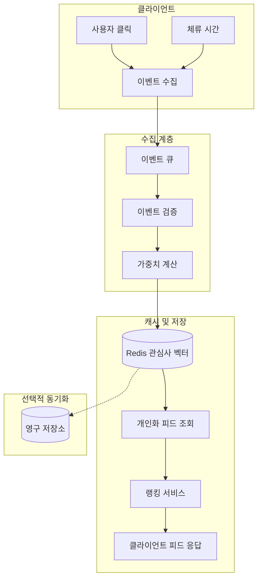

본 문서는 Newsfork 뉴스 개인화 엔진의 설계 원칙, 데이터 흐름, 그리고 Redis 기반 캐시 전략을 정의합니다.

## 1. 개요

개인화 엔진은 **사용자 클릭(click)** 및 **체류 시간(dwell time)** 신호를 수집하여 관심사 벡터를 추정하고, 이를 기반으로 뉴스 피드의 순위를 조정합니다.

## 2. 관심사 추출 로직

### 2.1 신호 정의

| 신호 | 설명 | 가중치 반영 |
|------|------|-------------|
| **클릭** | 기사 클릭 여부 | 클릭 시 해당 주제/엔티티 가중치 증가 |
| **체류 시간** | 기사 페이지 체류 시간(초) | 임계값 초과 시 긍정 신호로 가중치 반영 |

### 2.2 가중치 업데이트 규칙

- **클릭**: 해당 기사의 카테고리/태그/엔티티에 대해 가중치를 일정 비율만큼 증가시킵니다.
- **체류 시간**: 설정된 임계값(예: 30초) 이상일 경우, 클릭과 동일한 방향으로 가중치를 갱신합니다. 짧은 체류는 무시하거나 감쇠 적용합니다.
- **디케이(Decay)**: 시간이 지남에 따라 관심사 가중치를 주기적으로 감쇠시켜 최신 행동이 더 큰 영향을 갖도록 합니다.

## 3. Redis 캐시 전략

### 3.1 저장 구조

- **키 패턴**: `user:{userId}:interests` — 사용자별 관심사 벡터(해시 또는 정렬 집합).
- **TTL**: 비활성 사용자 키에 대한 TTL 설정으로 메모리 사용을 제한합니다.
- **쓰기**: 이벤트(클릭/체류) 수신 시 Redis에 증분 업데이트; 배치 집계 후 주기적으로 영구 저장소와 동기화할 수 있습니다.

### 3.2 읽기 전략

- 개인화된 피드 요청 시 Redis에서 관심사 벡터를 조회합니다.
- 캐시 미스 시 기본 프로필 또는 빈 벡터로 폴백하고, 비동기로 이벤트 히스토리에서 복구할 수 있습니다.

## 4. 전체 데이터 흐름

아래 Mermaid 다이어그램은 개인화 엔진의 데이터 흐름을 나타냅니다.

## 5. 요약

- **입력**: 클릭 이벤트, 체류 시간.
- **처리**: 가중치 기반 관심사 추출, 디케이 적용.
- **캐시**: Redis 사용자별 관심사 벡터, TTL 및 폴백 정책.
- **출력**: 개인화된 뉴스 피드 순위.

이 설계는 초안(draft)이며, 구현 시 버전 1.0.0 기준으로 변경 이력을 유지합니다.
